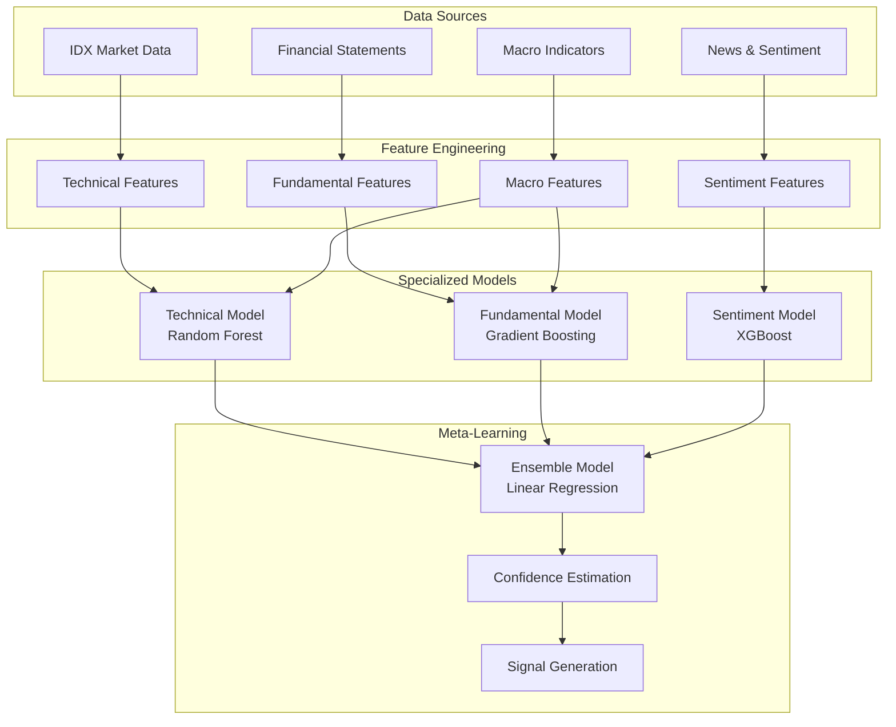

# Project Aurum - Machine Learning Strategy

## Table of Contents

1. [Overview](#overview)
2. [Ensemble Architecture](#ensemble-architecture)
3. [Feature Engineering](#feature-engineering)
4. [Model Components](#model-components)
5. [Training Methodology](#training-methodology)
6. [Model Evaluation](#model-evaluation)
7. [Production Pipeline](#production-pipeline)
8. [Performance Monitoring](#performance-monitoring)
9. [Model Updates & Retraining](#model-updates--retraining)
10. [Research & Development](#research--development)

## Overview

Project Aurum employs a sophisticated ensemble machine learning approach specifically designed for quantitative trading in the Indonesian Stock Exchange (IDX). The strategy combines multiple specialized models to capture different aspects of market behavior, from technical patterns to fundamental valuation and sentiment dynamics.

### Core Philosophy

**Multi-Factor Approach**: Rather than relying on a single model, we combine complementary approaches:
- **Technical Analysis**: Pattern recognition and momentum detection
- **Fundamental Analysis**: Value assessment and financial health
- **Sentiment Analysis**: Market psychology and news impact
- **Meta-Learning**: Dynamic model combination and confidence weighting

**Indonesian Market Focus**: Every component is optimized for IDX characteristics:
- **Liquidity Constraints**: Focus on LQ45 most liquid stocks
- **Market Hours**: Optimized for 09:00-15:49 WIB trading schedule
- **Currency Impact**: IDR volatility considerations
- **Regulatory Environment**: OJK compliance and T+2 settlement

### Strategy Objectives

| Objective | Target | Measurement |
|-----------|--------|-------------|
| **Annual Return** | 15-25% | Risk-adjusted returns vs IDX Composite |
| **Signal Accuracy** | 60-70% | Profitable signal percentage |
| **Sharpe Ratio** | 1.2-1.8 | Risk-adjusted performance |
| **Maximum Drawdown** | <15% | Peak-to-trough decline |
| **Information Ratio** | >1.0 | Alpha generation efficiency |

## Ensemble Architecture

### High-Level Architecture



### Model Responsibilities

#### Technical Model
- **Purpose**: Detect price patterns and momentum
- **Timeframe**: Short to medium-term (1-10 days)
- **Features**: Price/volume technical indicators
- **Algorithm**: Random Forest (200 trees)

#### Fundamental Model
- **Purpose**: Assess intrinsic value and financial health
- **Timeframe**: Medium to long-term (1-12 weeks)
- **Features**: Financial ratios and metrics
- **Algorithm**: Gradient Boosting (LightGBM)

#### Sentiment Model
- **Purpose**: Capture market psychology and news impact
- **Timeframe**: Very short-term (1-3 days)
- **Features**: News sentiment and momentum indicators
- **Algorithm**: XGBoost with custom loss function

#### Meta-Learning Model
- **Purpose**: Combine individual model predictions optimally
- **Approach**: Weighted ensemble with confidence estimation
- **Features**: Model predictions + market regime indicators
- **Algorithm**: Regularized Linear Regression

## Feature Engineering

### Technical Features (150+ indicators)

#### Price-Based Features
```python
def compute_price_features(ohlcv_data):
    """
    Comprehensive price-based technical indicators
    """
    features = {}

    # Moving Averages
    for period in [5, 10, 20, 50, 100, 200]:
        features[f'sma_{period}'] = ohlcv_data['close'].rolling(period).mean()
        features[f'ema_{period}'] = ohlcv_data['close'].ewm(span=period).mean()

    # Price Relative to Moving Averages
    features['price_sma20_ratio'] = ohlcv_data['close'] / features['sma_20']
    features['price_ema50_ratio'] = ohlcv_data['close'] / features['ema_50']

    # Momentum Indicators
    features['rsi_14'] = calculate_rsi(ohlcv_data['close'], 14)
    features['rsi_21'] = calculate_rsi(ohlcv_data['close'], 21)
    features['stoch_k'], features['stoch_d'] = calculate_stochastic(ohlcv_data)

    # Volatility Indicators
    features['atr_14'] = calculate_atr(ohlcv_data, 14)
    features['bollinger_upper'], features['bollinger_lower'] = calculate_bollinger_bands(ohlcv_data['close'])
    features['bollinger_position'] = (ohlcv_data['close'] - features['bollinger_lower']) / (features['bollinger_upper'] - features['bollinger_lower'])

    # MACD Family
    features['macd'], features['macd_signal'], features['macd_histogram'] = calculate_macd(ohlcv_data['close'])

    return features
```

#### Volume-Based Features
```python
def compute_volume_features(ohlcv_data):
    """
    Volume-based indicators for liquidity and momentum
    """
    features = {}

    # Volume Moving Averages
    features['volume_sma_20'] = ohlcv_data['volume'].rolling(20).mean()
    features['volume_ratio'] = ohlcv_data['volume'] / features['volume_sma_20']

    # Volume-Price Indicators
    features['vwap'] = calculate_vwap(ohlcv_data)
    features['obv'] = calculate_obv(ohlcv_data)
    features['accumulation_distribution'] = calculate_ad_line(ohlcv_data)

    # Money Flow
    features['mfi_14'] = calculate_mfi(ohlcv_data, 14)
    features['chaikin_mf'] = calculate_chaikin_mf(ohlcv_data)

    # Volume Profile
    features['volume_profile_support'], features['volume_profile_resistance'] = calculate_volume_profile(ohlcv_data)

    return features
```

#### Market Microstructure Features
```python
def compute_microstructure_features(tick_data):
    """
    High-frequency market microstructure indicators
    """
    features = {}

    # Bid-Ask Spread Metrics
    features['avg_spread'] = (tick_data['ask'] - tick_data['bid']).mean()
    features['spread_volatility'] = (tick_data['ask'] - tick_data['bid']).std()
    features['relative_spread'] = features['avg_spread'] / tick_data['mid_price'].mean()

    # Order Book Imbalance
    features['order_imbalance'] = (tick_data['bid_size'] - tick_data['ask_size']) / (tick_data['bid_size'] + tick_data['ask_size'])

    # Trade Size Analysis
    features['avg_trade_size'] = tick_data['volume'].mean()
    features['large_trade_ratio'] = (tick_data['volume'] > tick_data['volume'].quantile(0.95)).mean()

    # Price Impact
    features['price_impact'] = calculate_price_impact(tick_data)

    return features
```

### Fundamental Features (50+ ratios)

#### Valuation Metrics
```python
def compute_valuation_features(financial_data, price_data):
    """
    Traditional and advanced valuation metrics
    """
    features = {}

    # Basic Ratios
    features['pe_ratio'] = price_data['market_cap'] / financial_data['net_income']
    features['pb_ratio'] = price_data['market_cap'] / financial_data['book_value']
    features['ps_ratio'] = price_data['market_cap'] / financial_data['revenue']
    features['ev_ebitda'] = (price_data['market_cap'] + financial_data['total_debt'] - financial_data['cash']) / financial_data['ebitda']

    # Advanced Metrics
    features['peg_ratio'] = features['pe_ratio'] / (financial_data['eps_growth'] * 100)
    features['price_fcf'] = price_data['market_cap'] / financial_data['free_cash_flow']
    features['ev_revenue'] = (price_data['market_cap'] + financial_data['total_debt'] - financial_data['cash']) / financial_data['revenue']

    # Sector-Relative Metrics
    features['pe_sector_relative'] = features['pe_ratio'] / financial_data['sector_pe_median']
    features['pb_sector_relative'] = features['pb_ratio'] / financial_data['sector_pb_median']

    return features
```

#### Quality Metrics
```python
def compute_quality_features(financial_data):
    """
    Financial quality and health indicators
    """
    features = {}

    # Profitability
    features['roe'] = financial_data['net_income'] / financial_data['shareholders_equity']
    features['roa'] = financial_data['net_income'] / financial_data['total_assets']
    features['roic'] = financial_data['nopat'] / financial_data['invested_capital']
    features['gross_margin'] = financial_data['gross_profit'] / financial_data['revenue']
    features['operating_margin'] = financial_data['operating_income'] / financial_data['revenue']
    features['net_margin'] = financial_data['net_income'] / financial_data['revenue']

    # Efficiency
    features['asset_turnover'] = financial_data['revenue'] / financial_data['total_assets']
    features['inventory_turnover'] = financial_data['cogs'] / financial_data['inventory']
    features['receivables_turnover'] = financial_data['revenue'] / financial_data['receivables']

    # Financial Health
    features['current_ratio'] = financial_data['current_assets'] / financial_data['current_liabilities']
    features['quick_ratio'] = (financial_data['current_assets'] - financial_data['inventory']) / financial_data['current_liabilities']
    features['debt_to_equity'] = financial_data['total_debt'] / financial_data['shareholders_equity']
    features['interest_coverage'] = financial_data['ebitda'] / financial_data['interest_expense']

    # Growth
    features['revenue_growth'] = financial_data['revenue_growth_yoy']
    features['earnings_growth'] = financial_data['earnings_growth_yoy']
    features['book_value_growth'] = financial_data['book_value_growth_yoy']

    return features
```

### Sentiment Features (20+ indicators)

#### News Sentiment Analysis
```python
def compute_sentiment_features(news_data):
    """
    News sentiment and alternative data features
    """
    features = {}

    # Sentiment Scores
    features['news_sentiment_score'] = calculate_weighted_sentiment(news_data)
    features['news_sentiment_momentum'] = calculate_sentiment_momentum(news_data)
    features['sentiment_volatility'] = calculate_sentiment_volatility(news_data)

    # News Volume and Coverage
    features['news_volume'] = len(news_data)
    features['news_volume_ma'] = calculate_news_volume_ma(news_data)
    features['coverage_breadth'] = calculate_coverage_breadth(news_data)

    # Source Quality
    features['high_quality_source_ratio'] = calculate_source_quality_ratio(news_data)
    features['analyst_sentiment'] = extract_analyst_sentiment(news_data)

    return features
```

#### Market Momentum Features
```python
def compute_momentum_features(price_data, market_data):
    """
    Market-wide momentum and sentiment indicators
    """
    features = {}

    # Relative Performance
    features['vs_market_1w'] = calculate_relative_performance(price_data, market_data, '1w')
    features['vs_market_1m'] = calculate_relative_performance(price_data, market_data, '1m')
    features['vs_sector_1w'] = calculate_sector_relative_performance(price_data, '1w')

    # Money Flow
    features['institutional_flow'] = estimate_institutional_flow(price_data)
    features['foreign_flow'] = extract_foreign_flow_data(price_data)

    # Market Regime
    features['market_regime'] = detect_market_regime(market_data)
    features['volatility_regime'] = detect_volatility_regime(market_data)

    return features
```

## Model Components

### Technical Model (Random Forest)

#### Architecture
```python
class TechnicalModel:
    def __init__(self):
        self.model = RandomForestRegressor(
            n_estimators=200,
            max_depth=15,
            min_samples_split=20,
            min_samples_leaf=10,
            max_features='sqrt',
            bootstrap=True,
            random_state=42,
            n_jobs=-1
        )
        self.feature_selector = SelectFromModel(
            RandomForestRegressor(n_estimators=50),
            threshold='median'
        )

    def preprocess_features(self, features):
        """Technical feature preprocessing"""
        # Handle missing values
        features = features.fillna(method='ffill').fillna(0)

        # Normalize features
        features = self.scaler.transform(features)

        # Feature selection
        features = self.feature_selector.transform(features)

        return features

    def predict(self, features):
        """Generate technical signals"""
        processed_features = self.preprocess_features(features)
        predictions = self.model.predict(processed_features)

        # Convert to signal strength (-1 to 1)
        signals = np.tanh(predictions)

        return signals
```

#### Feature Importance Analysis
```python
def analyze_technical_features():
    """
    Top technical features by importance
    """
    feature_importance = {
        'rsi_14': 0.125,           # RSI momentum
        'price_sma20_ratio': 0.098, # Price vs moving average
        'macd_histogram': 0.087,    # MACD momentum
        'bollinger_position': 0.078, # Bollinger band position
        'volume_ratio': 0.065,      # Volume relative to average
        'atr_14': 0.052,           # Volatility
        'obv_momentum': 0.048,      # Volume momentum
        'williams_r': 0.043,        # Williams %R
        'stoch_k': 0.041,          # Stochastic oscillator
        'ema_slope_20': 0.038      # Moving average slope
    }
    return feature_importance
```

### Fundamental Model (Gradient Boosting)

#### Architecture
```python
class FundamentalModel:
    def __init__(self):
        self.model = LGBMRegressor(
            objective='regression',
            num_leaves=31,
            learning_rate=0.05,
            feature_fraction=0.9,
            bagging_fraction=0.8,
            bagging_freq=5,
            max_depth=10,
            min_data_in_leaf=20,
            lambda_l1=0.1,
            lambda_l2=0.1,
            verbose=-1,
            random_state=42
        )

    def feature_engineering(self, fundamental_data):
        """Advanced fundamental feature engineering"""
        features = fundamental_data.copy()

        # Industry-relative metrics
        features['roe_industry_zscore'] = calculate_industry_zscore(features['roe'])
        features['pe_industry_percentile'] = calculate_industry_percentile(features['pe_ratio'])

        # Quality scores
        features['profitability_score'] = calculate_profitability_score(features)
        features['efficiency_score'] = calculate_efficiency_score(features)
        features['leverage_score'] = calculate_leverage_score(features)

        # Growth consistency
        features['growth_consistency'] = calculate_growth_consistency(features)
        features['earnings_quality'] = calculate_earnings_quality(features)

        return features

    def predict(self, features):
        """Generate fundamental signals"""
        engineered_features = self.feature_engineering(features)
        predictions = self.model.predict(engineered_features)

        # Convert to signal strength
        signals = np.tanh(predictions * 0.5)  # More conservative scaling

        return signals
```

#### Sector-Specific Models
```python
class SectorSpecificModel:
    """
    Specialized models for different sectors
    """
    def __init__(self):
        self.sector_models = {
            'banking': BankingModel(),
            'telecommunications': TelecomModel(),
            'consumer_goods': ConsumerModel(),
            'mining': MiningModel()
        }

    def predict_by_sector(self, features, sector):
        """Sector-specific predictions"""
        if sector in self.sector_models:
            return self.sector_models[sector].predict(features)
        else:
            return self.general_model.predict(features)
```

### Sentiment Model (XGBoost)

#### Architecture
```python
class SentimentModel:
    def __init__(self):
        self.model = XGBRegressor(
            objective='reg:squarederror',
            n_estimators=300,
            max_depth=8,
            learning_rate=0.01,
            subsample=0.8,
            colsample_bytree=0.8,
            reg_alpha=0.1,
            reg_lambda=0.1,
            random_state=42
        )

        # Custom loss function for asymmetric penalties
        self.custom_loss = self.asymmetric_loss

    def asymmetric_loss(self, y_true, y_pred):
        """
        Custom loss function that penalizes false positive signals more
        """
        residual = y_true - y_pred
        loss = np.where(residual > 0, 2 * residual**2, residual**2)
        return loss

    def predict(self, features):
        """Generate sentiment-based signals"""
        predictions = self.model.predict(features)

        # Apply confidence weighting based on sentiment strength
        confidence = calculate_sentiment_confidence(features)
        signals = predictions * confidence

        return np.tanh(signals)
```

#### News Processing Pipeline
```python
class NewsProcessor:
    """
    Advanced news processing for sentiment analysis
    """
    def __init__(self):
        self.sentiment_analyzer = IndoBERTSentiment()  # Indonesian language model
        self.entity_extractor = FinancialEntityExtractor()
        self.topic_classifier = TopicClassifier()

    def process_news(self, news_articles):
        """
        Comprehensive news processing pipeline
        """
        processed_news = []

        for article in news_articles:
            # Extract sentiment
            sentiment = self.sentiment_analyzer.analyze(article['content'])

            # Extract financial entities
            entities = self.entity_extractor.extract(article['content'])

            # Classify topics
            topics = self.topic_classifier.classify(article['content'])

            # Calculate relevance score
            relevance = calculate_relevance_score(article, entities)

            processed_news.append({
                'sentiment': sentiment,
                'entities': entities,
                'topics': topics,
                'relevance': relevance,
                'source_credibility': get_source_credibility(article['source']),
                'timestamp': article['timestamp']
            })

        return processed_news
```

### Ensemble Model (Meta-Learning)

#### Architecture
```python
class EnsembleModel:
    def __init__(self):
        self.meta_model = Ridge(
            alpha=1.0,
            fit_intercept=True,
            normalize=True
        )

        self.confidence_model = GradientBoostingRegressor(
            n_estimators=100,
            max_depth=5,
            learning_rate=0.1
        )

    def combine_predictions(self, technical_pred, fundamental_pred, sentiment_pred, market_features):
        """
        Meta-learning approach to combine model predictions
        """
        # Create meta-features
        meta_features = np.column_stack([
            technical_pred,
            fundamental_pred,
            sentiment_pred,
            technical_pred * fundamental_pred,  # Interaction terms
            technical_pred * sentiment_pred,
            fundamental_pred * sentiment_pred,
            market_features['volatility_regime'],
            market_features['market_regime'],
            market_features['liquidity_score']
        ])

        # Generate ensemble prediction
        ensemble_pred = self.meta_model.predict(meta_features)

        # Calculate prediction confidence
        confidence = self.confidence_model.predict(meta_features)

        # Apply confidence weighting
        final_signals = ensemble_pred * np.clip(confidence, 0.1, 1.0)

        return final_signals, confidence
```

#### Dynamic Weighting
```python
class DynamicWeighting:
    """
    Adaptive weighting based on recent model performance
    """
    def __init__(self, window_size=252):  # 1 year of trading days
        self.window_size = window_size
        self.performance_history = defaultdict(list)

    def update_performance(self, model_name, prediction, actual):
        """Update model performance tracking"""
        accuracy = 1 if prediction * actual > 0 else 0
        self.performance_history[model_name].append(accuracy)

        # Keep only recent history
        if len(self.performance_history[model_name]) > self.window_size:
            self.performance_history[model_name].pop(0)

    def get_dynamic_weights(self):
        """Calculate dynamic weights based on recent performance"""
        weights = {}

        for model_name in ['technical', 'fundamental', 'sentiment']:
            if len(self.performance_history[model_name]) > 50:  # Minimum history
                recent_accuracy = np.mean(self.performance_history[model_name][-50:])
                weights[model_name] = max(0.1, recent_accuracy)  # Minimum weight 0.1
            else:
                weights[model_name] = 1.0 / 3  # Equal weight initially

        # Normalize weights
        total_weight = sum(weights.values())
        weights = {k: v / total_weight for k, v in weights.items()}

        return weights
```

## Training Methodology

### Data Preparation

#### Train/Validation/Test Split
```python
def prepare_training_data(start_date='2018-01-01', end_date='2024-01-01'):
    """
    Time-series aware data splitting
    """
    # Avoid look-ahead bias with time-based splits
    total_data = load_market_data(start_date, end_date)

    # Training: 2018-2021 (70%)
    train_start = '2018-01-01'
    train_end = '2021-12-31'

    # Validation: 2022 (15%)
    val_start = '2022-01-01'
    val_end = '2022-12-31'

    # Test: 2023 (15%)
    test_start = '2023-01-01'
    test_end = '2023-12-31'

    return split_data_by_time(total_data, train_start, train_end, val_start, val_end, test_start, test_end)
```

#### Target Variable Engineering
```python
def create_target_variables(price_data, holding_periods=[1, 3, 5, 10]):
    """
    Multiple target variables for different holding periods
    """
    targets = {}

    for period in holding_periods:
        # Forward returns
        returns = price_data['close'].pct_change(period).shift(-period)

        # Risk-adjusted returns (Sharpe-like)
        volatility = returns.rolling(20).std()
        risk_adjusted_returns = returns / volatility

        # Classification targets (buy/sell/hold)
        targets[f'return_{period}d'] = returns
        targets[f'risk_adj_return_{period}d'] = risk_adjusted_returns
        targets[f'signal_{period}d'] = pd.cut(
            risk_adjusted_returns,
            bins=[-np.inf, -0.5, 0.5, np.inf],
            labels=[-1, 0, 1]  # Sell, Hold, Buy
        )

    return targets
```

### Training Pipeline

#### Cross-Validation Strategy
```python
class TimeSeriesCrossValidator:
    """
    Time-series aware cross-validation
    """
    def __init__(self, n_splits=5, test_size=252, gap=21):
        self.n_splits = n_splits
        self.test_size = test_size  # ~1 year
        self.gap = gap  # ~1 month gap to avoid overlap

    def split(self, X, y):
        """Generate time-series cross-validation splits"""
        n_samples = len(X)

        for i in range(self.n_splits):
            # Calculate split points
            test_end = n_samples - i * (self.test_size + self.gap)
            test_start = test_end - self.test_size
            train_end = test_start - self.gap
            train_start = 0

            if train_end <= train_start:
                break

            train_idx = range(train_start, train_end)
            test_idx = range(test_start, test_end)

            yield train_idx, test_idx
```

#### Hyperparameter Optimization
```python
def optimize_hyperparameters(model_type, X_train, y_train):
    """
    Bayesian optimization for hyperparameter tuning
    """
    if model_type == 'technical':
        search_space = {
            'n_estimators': Integer(100, 500),
            'max_depth': Integer(10, 30),
            'min_samples_split': Integer(10, 50),
            'min_samples_leaf': Integer(5, 25),
            'max_features': Categorical(['sqrt', 'log2', 0.5, 0.8])
        }
        base_model = RandomForestRegressor()

    elif model_type == 'fundamental':
        search_space = {
            'num_leaves': Integer(20, 100),
            'learning_rate': Real(0.01, 0.3, prior='log-uniform'),
            'feature_fraction': Real(0.4, 1.0),
            'bagging_fraction': Real(0.4, 1.0),
            'max_depth': Integer(5, 15),
            'min_data_in_leaf': Integer(10, 50)
        }
        base_model = LGBMRegressor()

    elif model_type == 'sentiment':
        search_space = {
            'n_estimators': Integer(100, 500),
            'max_depth': Integer(5, 15),
            'learning_rate': Real(0.01, 0.3, prior='log-uniform'),
            'subsample': Real(0.6, 1.0),
            'colsample_bytree': Real(0.6, 1.0),
            'reg_alpha': Real(0.01, 10, prior='log-uniform'),
            'reg_lambda': Real(0.01, 10, prior='log-uniform')
        }
        base_model = XGBRegressor()

    # Bayesian optimization
    optimizer = BayesSearchCV(
        base_model,
        search_space,
        n_iter=50,
        cv=TimeSeriesCrossValidator(),
        scoring='neg_mean_squared_error',
        n_jobs=-1,
        random_state=42
    )

    optimizer.fit(X_train, y_train)
    return optimizer.best_estimator_, optimizer.best_params_
```

### Training Process

#### Model Training Workflow
```python
class ModelTrainer:
    def __init__(self):
        self.models = {}
        self.feature_importances = {}
        self.performance_metrics = {}

    def train_all_models(self, data):
        """Complete model training pipeline"""

        # 1. Technical Model
        print("Training Technical Model...")
        tech_features = extract_technical_features(data)
        self.models['technical'], tech_performance = self.train_technical_model(tech_features)
        self.performance_metrics['technical'] = tech_performance

        # 2. Fundamental Model
        print("Training Fundamental Model...")
        fund_features = extract_fundamental_features(data)
        self.models['fundamental'], fund_performance = self.train_fundamental_model(fund_features)
        self.performance_metrics['fundamental'] = fund_performance

        # 3. Sentiment Model
        print("Training Sentiment Model...")
        sent_features = extract_sentiment_features(data)
        self.models['sentiment'], sent_performance = self.train_sentiment_model(sent_features)
        self.performance_metrics['sentiment'] = sent_performance

        # 4. Ensemble Model
        print("Training Ensemble Model...")
        ensemble_features = self.create_ensemble_features(data)
        self.models['ensemble'], ensemble_performance = self.train_ensemble_model(ensemble_features)
        self.performance_metrics['ensemble'] = ensemble_performance

        # 5. Save models
        self.save_models()

        return self.models, self.performance_metrics

    def train_technical_model(self, features):
        """Technical model training with cross-validation"""
        X = features['features']
        y = features['targets']

        # Split data
        X_train, X_val, y_train, y_val = time_series_split(X, y, test_size=0.2)

        # Hyperparameter optimization
        best_model, best_params = optimize_hyperparameters('technical', X_train, y_train)

        # Train final model
        best_model.fit(X_train, y_train)

        # Evaluate
        val_predictions = best_model.predict(X_val)
        performance = evaluate_model(y_val, val_predictions)

        # Feature importance
        self.feature_importances['technical'] = dict(zip(
            features['feature_names'],
            best_model.feature_importances_
        ))

        return best_model, performance
```

#### Feature Selection
```python
def feature_selection_pipeline(X, y, model_type):
    """
    Multi-stage feature selection
    """

    # 1. Remove low-variance features
    selector_variance = VarianceThreshold(threshold=0.01)
    X_variance = selector_variance.fit_transform(X)

    # 2. Remove highly correlated features
    correlation_matrix = np.corrcoef(X_variance.T)
    high_corr_pairs = np.where(np.abs(correlation_matrix) > 0.95)
    remove_indices = []
    for i, j in zip(high_corr_pairs[0], high_corr_pairs[1]):
        if i < j:  # Avoid duplicate pairs
            remove_indices.append(j)

    X_corr = np.delete(X_variance, remove_indices, axis=1)

    # 3. Model-based feature selection
    if model_type == 'technical':
        selector_model = SelectFromModel(RandomForestRegressor(n_estimators=50))
    elif model_type == 'fundamental':
        selector_model = SelectFromModel(LGBMRegressor(n_estimators=50))
    else:
        selector_model = SelectFromModel(XGBRegressor(n_estimators=50))

    X_selected = selector_model.fit_transform(X_corr, y)

    # 4. Recursive feature elimination
    if model_type == 'technical':
        estimator = RandomForestRegressor(n_estimators=20)
    elif model_type == 'fundamental':
        estimator = LGBMRegressor(n_estimators=20)
    else:
        estimator = XGBRegressor(n_estimators=20)

    rfe = RFE(estimator, n_features_to_select=min(50, X_selected.shape[1]))
    X_final = rfe.fit_transform(X_selected, y)

    return X_final, rfe.get_feature_names_out()
```

## Model Evaluation

### Performance Metrics

#### Classification Metrics
```python
def calculate_classification_metrics(y_true, y_pred, y_pred_proba=None):
    """
    Comprehensive classification evaluation
    """
    metrics = {}

    # Basic metrics
    metrics['accuracy'] = accuracy_score(y_true, y_pred)
    metrics['precision'] = precision_score(y_true, y_pred, average='weighted')
    metrics['recall'] = recall_score(y_true, y_pred, average='weighted')
    metrics['f1_score'] = f1_score(y_true, y_pred, average='weighted')

    # Class-specific metrics
    report = classification_report(y_true, y_pred, output_dict=True)
    metrics['buy_precision'] = report['1']['precision']
    metrics['buy_recall'] = report['1']['recall']
    metrics['sell_precision'] = report['-1']['precision']
    metrics['sell_recall'] = report['-1']['recall']

    # Probability-based metrics
    if y_pred_proba is not None:
        metrics['log_loss'] = log_loss(y_true, y_pred_proba)
        metrics['roc_auc'] = roc_auc_score(y_true, y_pred_proba, multi_class='ovr')

    return metrics
```

#### Financial Metrics
```python
def calculate_financial_metrics(signals, returns, transaction_costs=0.001):
    """
    Financial performance evaluation
    """
    # Calculate strategy returns
    strategy_returns = signals.shift(1) * returns - np.abs(signals.diff()) * transaction_costs

    metrics = {}

    # Return metrics
    metrics['total_return'] = (1 + strategy_returns).prod() - 1
    metrics['annualized_return'] = (1 + metrics['total_return']) ** (252 / len(returns)) - 1
    metrics['volatility'] = strategy_returns.std() * np.sqrt(252)

    # Risk-adjusted metrics
    risk_free_rate = 0.05  # 5% risk-free rate
    excess_returns = strategy_returns - risk_free_rate / 252
    metrics['sharpe_ratio'] = excess_returns.mean() / strategy_returns.std() * np.sqrt(252)

    # Downside risk
    downside_returns = strategy_returns[strategy_returns < 0]
    metrics['sortino_ratio'] = excess_returns.mean() / downside_returns.std() * np.sqrt(252)

    # Drawdown
    cumulative_returns = (1 + strategy_returns).cumprod()
    running_max = cumulative_returns.expanding().max()
    drawdowns = (cumulative_returns - running_max) / running_max
    metrics['max_drawdown'] = drawdowns.min()

    # Hit rate
    metrics['hit_rate'] = (strategy_returns > 0).mean()

    # Information ratio
    benchmark_returns = returns  # Using market returns as benchmark
    active_returns = strategy_returns - benchmark_returns
    metrics['information_ratio'] = active_returns.mean() / active_returns.std() * np.sqrt(252)

    return metrics
```

### Backtesting Framework

#### Vectorized Backtesting
```python
class Backtester:
    def __init__(self, initial_capital=1000000000):  # 1B IDR
        self.initial_capital = initial_capital
        self.transaction_costs = 0.0015  # 0.15% (including broker fees and taxes)

    def backtest_strategy(self, signals, prices, start_date, end_date):
        """
        Comprehensive backtesting with realistic constraints
        """
        results = {}

        # Filter data for backtest period
        mask = (prices.index >= start_date) & (prices.index <= end_date)
        prices_bt = prices[mask]
        signals_bt = signals[mask]

        # Initialize portfolio
        portfolio = Portfolio(self.initial_capital)

        # Daily simulation
        for date in prices_bt.index:
            daily_prices = prices_bt.loc[date]
            daily_signals = signals_bt.loc[date]

            # Update portfolio with current prices
            portfolio.update_prices(daily_prices)

            # Execute trades based on signals
            trades = self.generate_trades(portfolio, daily_signals, daily_prices)
            portfolio.execute_trades(trades, self.transaction_costs)

            # Record portfolio state
            portfolio.record_state(date)

        # Calculate performance metrics
        results['portfolio_history'] = portfolio.get_history()
        results['performance_metrics'] = self.calculate_performance_metrics(portfolio)
        results['trade_analysis'] = self.analyze_trades(portfolio.get_trades())

        return results

    def generate_trades(self, portfolio, signals, prices):
        """
        Generate trades based on signals and portfolio constraints
        """
        trades = []
        current_weights = portfolio.get_weights()
        target_weights = self.calculate_target_weights(signals)

        for symbol in signals.index:
            current_weight = current_weights.get(symbol, 0)
            target_weight = target_weights.get(symbol, 0)
            weight_diff = target_weight - current_weight

            if abs(weight_diff) > 0.001:  # Minimum trade threshold
                trade_value = weight_diff * portfolio.total_value
                shares = int(trade_value / prices[symbol] / 100) * 100  # Round to lot size

                if shares != 0:
                    trades.append({
                        'symbol': symbol,
                        'shares': shares,
                        'price': prices[symbol],
                        'type': 'buy' if shares > 0 else 'sell'
                    })

        return trades
```

#### Out-of-Sample Testing
```python
def walk_forward_analysis(data, model, window_size=252, step_size=21):
    """
    Walk-forward analysis for robust out-of-sample testing
    """
    results = []

    for start_idx in range(window_size, len(data) - step_size, step_size):
        # Training window
        train_start = start_idx - window_size
        train_end = start_idx
        train_data = data.iloc[train_start:train_end]

        # Test window
        test_start = start_idx
        test_end = start_idx + step_size
        test_data = data.iloc[test_start:test_end]

        # Retrain model
        model.fit(train_data['features'], train_data['targets'])

        # Generate predictions
        predictions = model.predict(test_data['features'])

        # Evaluate performance
        performance = evaluate_predictions(test_data['targets'], predictions)
        performance['period_start'] = test_data.index[0]
        performance['period_end'] = test_data.index[-1]

        results.append(performance)

    return pd.DataFrame(results)
```

## Production Pipeline

### Real-time Inference

#### Daily Signal Generation
```python
class ProductionPipeline:
    def __init__(self):
        self.models = load_production_models()
        self.feature_cache = FeatureCache()
        self.signal_validator = SignalValidator()

    async def generate_daily_signals(self):
        """
        Main production signal generation pipeline
        """
        try:
            # 1. Data collection
            market_data = await self.collect_market_data()
            fundamental_data = await self.collect_fundamental_data()
            news_data = await self.collect_news_data()

            # 2. Feature engineering
            features = await self.engineer_features(market_data, fundamental_data, news_data)

            # 3. Model inference
            technical_signals = self.models['technical'].predict(features['technical'])
            fundamental_signals = self.models['fundamental'].predict(features['fundamental'])
            sentiment_signals = self.models['sentiment'].predict(features['sentiment'])

            # 4. Ensemble combination
            final_signals = self.models['ensemble'].combine_predictions(
                technical_signals, fundamental_signals, sentiment_signals, features['market']
            )

            # 5. Signal validation
            validated_signals = self.signal_validator.validate(final_signals)

            # 6. Risk filtering
            risk_filtered_signals = self.apply_risk_filters(validated_signals)

            # 7. Position sizing
            position_recommendations = self.calculate_position_sizes(risk_filtered_signals)

            # 8. Save results
            await self.save_signals(position_recommendations)

            # 9. Send alerts
            await self.send_signal_alerts(position_recommendations)

            return position_recommendations

        except Exception as e:
            logger.error(f"Signal generation failed: {str(e)}")
            await self.send_error_alert(e)
            raise
```

#### Feature Caching
```python
class FeatureCache:
    def __init__(self, redis_client):
        self.redis = redis_client
        self.cache_ttl = {
            'technical': 300,      # 5 minutes
            'fundamental': 3600,   # 1 hour
            'sentiment': 900,      # 15 minutes
            'market': 300          # 5 minutes
        }

    async def get_cached_features(self, symbol, feature_type):
        """Retrieve cached features with fallback to computation"""
        cache_key = f"features:{feature_type}:{symbol}"
        cached_data = await self.redis.get(cache_key)

        if cached_data:
            return json.loads(cached_data)

        # Compute features if not cached
        features = await self.compute_features(symbol, feature_type)

        # Cache results
        await self.redis.setex(
            cache_key,
            self.cache_ttl[feature_type],
            json.dumps(features, default=str)
        )

        return features
```

### Model Deployment

#### Model Versioning
```python
class ModelManager:
    def __init__(self, model_store_path):
        self.model_store = model_store_path
        self.current_models = {}
        self.model_metadata = {}

    def deploy_new_model(self, model_name, model_object, metadata):
        """Deploy new model version with A/B testing"""

        # Generate version ID
        version_id = f"{model_name}_v{datetime.now().strftime('%Y%m%d_%H%M%S')}"

        # Save model
        model_path = os.path.join(self.model_store, f"{version_id}.pkl")
        joblib.dump(model_object, model_path)

        # Update metadata
        metadata['version_id'] = version_id
        metadata['deployed_at'] = datetime.now()
        metadata['model_path'] = model_path

        self.model_metadata[version_id] = metadata

        # Gradual rollout (canary deployment)
        self.setup_canary_deployment(model_name, version_id)

    def setup_canary_deployment(self, model_name, new_version_id, traffic_split=0.1):
        """
        Canary deployment: gradually shift traffic to new model
        """
        current_version = self.current_models.get(model_name)

        if current_version:
            # Set up A/B test
            self.ab_test_config[model_name] = {
                'current_version': current_version,
                'new_version': new_version_id,
                'traffic_split': traffic_split,
                'start_time': datetime.now()
            }
        else:
            # First deployment
            self.current_models[model_name] = new_version_id

    def get_model_for_prediction(self, model_name, request_id):
        """
        Route prediction request to appropriate model version
        """
        ab_config = self.ab_test_config.get(model_name)

        if ab_config:
            # A/B testing active
            hash_value = hashlib.md5(request_id.encode()).hexdigest()
            if int(hash_value, 16) % 100 < ab_config['traffic_split'] * 100:
                return self.load_model(ab_config['new_version'])
            else:
                return self.load_model(ab_config['current_version'])
        else:
            # Normal operation
            version_id = self.current_models[model_name]
            return self.load_model(version_id)
```

## Performance Monitoring

### Model Drift Detection

#### Statistical Drift Detection
```python
class DriftDetector:
    def __init__(self, reference_data, significance_level=0.05):
        self.reference_data = reference_data
        self.significance_level = significance_level

    def detect_feature_drift(self, new_data, feature_columns):
        """
        Detect drift in input features using statistical tests
        """
        drift_results = {}

        for feature in feature_columns:
            if feature in self.reference_data.columns and feature in new_data.columns:
                # Kolmogorov-Smirnov test for distribution change
                statistic, p_value = ks_2samp(
                    self.reference_data[feature].dropna(),
                    new_data[feature].dropna()
                )

                drift_results[feature] = {
                    'ks_statistic': statistic,
                    'p_value': p_value,
                    'drift_detected': p_value < self.significance_level,
                    'drift_magnitude': statistic
                }

        return drift_results

    def detect_prediction_drift(self, reference_predictions, new_predictions):
        """
        Detect drift in model predictions
        """
        # Population Stability Index (PSI)
        psi = self.calculate_psi(reference_predictions, new_predictions)

        # Drift severity levels
        if psi < 0.1:
            drift_level = 'no_drift'
        elif psi < 0.2:
            drift_level = 'moderate_drift'
        else:
            drift_level = 'severe_drift'

        return {
            'psi': psi,
            'drift_level': drift_level,
            'action_required': psi > 0.2
        }

    def calculate_psi(self, reference, new_data, bins=10):
        """Calculate Population Stability Index"""
        ref_counts, bin_edges = np.histogram(reference, bins=bins)
        new_counts, _ = np.histogram(new_data, bins=bin_edges)

        # Normalize to probabilities
        ref_probs = ref_counts / len(reference)
        new_probs = new_counts / len(new_data)

        # Avoid division by zero
        ref_probs = np.where(ref_probs == 0, 0.0001, ref_probs)
        new_probs = np.where(new_probs == 0, 0.0001, new_probs)

        # Calculate PSI
        psi = np.sum((new_probs - ref_probs) * np.log(new_probs / ref_probs))

        return psi
```

#### Performance Degradation Detection
```python
class PerformanceMonitor:
    def __init__(self, baseline_metrics):
        self.baseline_metrics = baseline_metrics
        self.performance_history = []

    def monitor_model_performance(self, predictions, actual_returns):
        """
        Monitor real-time model performance
        """
        # Calculate current metrics
        current_metrics = calculate_financial_metrics(predictions, actual_returns)

        # Compare with baseline
        performance_changes = {}
        for metric, current_value in current_metrics.items():
            baseline_value = self.baseline_metrics.get(metric, 0)
            change_pct = (current_value - baseline_value) / abs(baseline_value) if baseline_value != 0 else 0

            performance_changes[metric] = {
                'current': current_value,
                'baseline': baseline_value,
                'change_pct': change_pct,
                'degraded': self.is_degraded(metric, change_pct)
            }

        # Store history
        self.performance_history.append({
            'timestamp': datetime.now(),
            'metrics': current_metrics,
            'changes': performance_changes
        })

        # Alert if significant degradation
        degraded_metrics = [k for k, v in performance_changes.items() if v['degraded']]
        if degraded_metrics:
            self.send_degradation_alert(degraded_metrics, performance_changes)

        return performance_changes

    def is_degraded(self, metric, change_pct):
        """Define degradation thresholds for different metrics"""
        thresholds = {
            'sharpe_ratio': -0.2,      # 20% decrease
            'hit_rate': -0.1,          # 10% decrease
            'information_ratio': -0.3,  # 30% decrease
            'max_drawdown': 0.5        # 50% increase (worse)
        }

        threshold = thresholds.get(metric, -0.15)  # Default 15% decrease

        if metric == 'max_drawdown':
            return change_pct > threshold  # Worse drawdown
        else:
            return change_pct < threshold  # Worse performance
```

## Model Updates & Retraining

### Automated Retraining

#### Retraining Triggers
```python
class RetrainingScheduler:
    def __init__(self):
        self.retraining_triggers = {
            'scheduled': {
                'frequency': 'monthly',
                'day_of_month': 1
            },
            'performance_degradation': {
                'sharpe_ratio_threshold': -0.2,
                'hit_rate_threshold': -0.15
            },
            'drift_detection': {
                'psi_threshold': 0.2,
                'feature_drift_threshold': 0.05
            },
            'data_availability': {
                'min_new_samples': 1000
            }
        }

    def check_retraining_conditions(self):
        """
        Check if retraining should be triggered
        """
        triggers_met = []

        # 1. Scheduled retraining
        if self.check_scheduled_retraining():
            triggers_met.append('scheduled')

        # 2. Performance degradation
        if self.check_performance_degradation():
            triggers_met.append('performance_degradation')

        # 3. Data drift
        if self.check_data_drift():
            triggers_met.append('drift_detection')

        # 4. Sufficient new data
        if self.check_data_availability():
            triggers_met.append('data_availability')

        return triggers_met

    async def trigger_retraining(self, trigger_reasons):
        """
        Initiate model retraining process
        """
        # Create retraining job
        job_id = f"retrain_{datetime.now().strftime('%Y%m%d_%H%M%S')}"

        # Start retraining pipeline
        retraining_task = RetrainingPipeline(
            job_id=job_id,
            trigger_reasons=trigger_reasons
        )

        # Run in background
        await retraining_task.execute()

        return job_id
```

#### Incremental Learning
```python
class IncrementalLearning:
    def __init__(self, model, learning_rate=0.01):
        self.model = model
        self.learning_rate = learning_rate
        self.forgetting_factor = 0.95  # For exponential decay of old data

    def update_model(self, new_features, new_targets):
        """
        Update model with new data using incremental learning
        """
        # For online learning algorithms
        if hasattr(self.model, 'partial_fit'):
            self.model.partial_fit(new_features, new_targets)

        # For batch models, use weighted training
        else:
            # Get existing training data
            old_features, old_targets = self.get_existing_training_data()

            # Apply forgetting factor to old data
            old_sample_weights = np.full(len(old_targets), self.forgetting_factor)
            new_sample_weights = np.ones(len(new_targets))

            # Combine data
            combined_features = np.vstack([old_features, new_features])
            combined_targets = np.hstack([old_targets, new_targets])
            combined_weights = np.hstack([old_sample_weights, new_sample_weights])

            # Retrain with weighted samples
            self.model.fit(
                combined_features,
                combined_targets,
                sample_weight=combined_weights
            )

        # Update training data store
        self.update_training_data_store(new_features, new_targets)
```

### Model Validation Pipeline

#### Automated Testing
```python
class ModelValidationPipeline:
    def __init__(self):
        self.validation_tests = [
            self.test_data_quality,
            self.test_feature_importance,
            self.test_prediction_distribution,
            self.test_performance_metrics,
            self.test_model_stability,
            self.test_business_logic
        ]

    def validate_new_model(self, model, test_data):
        """
        Comprehensive validation of newly trained model
        """
        validation_results = {}

        for test in self.validation_tests:
            try:
                result = test(model, test_data)
                validation_results[test.__name__] = result
            except Exception as e:
                validation_results[test.__name__] = {
                    'passed': False,
                    'error': str(e)
                }

        # Overall validation status
        all_passed = all(r.get('passed', False) for r in validation_results.values())

        return {
            'overall_status': 'passed' if all_passed else 'failed',
            'individual_tests': validation_results,
            'validation_timestamp': datetime.now()
        }

    def test_performance_metrics(self, model, test_data):
        """Test if model meets minimum performance requirements"""
        predictions = model.predict(test_data['features'])
        metrics = calculate_financial_metrics(predictions, test_data['returns'])

        requirements = {
            'sharpe_ratio': 0.8,      # Minimum Sharpe ratio
            'hit_rate': 0.52,         # Minimum hit rate
            'max_drawdown': -0.20     # Maximum drawdown
        }

        passed_tests = {}
        for metric, min_value in requirements.items():
            if metric == 'max_drawdown':
                passed_tests[metric] = metrics[metric] > min_value  # Less negative is better
            else:
                passed_tests[metric] = metrics[metric] >= min_value

        return {
            'passed': all(passed_tests.values()),
            'metrics': metrics,
            'requirements': requirements,
            'test_results': passed_tests
        }

    def test_model_stability(self, model, test_data):
        """Test model stability across different market conditions"""
        # Split test data by market regime
        bull_market_data = test_data[test_data['market_regime'] == 'bull']
        bear_market_data = test_data[test_data['market_regime'] == 'bear']
        sideways_market_data = test_data[test_data['market_regime'] == 'sideways']

        stability_results = {}

        for regime, data in [('bull', bull_market_data), ('bear', bear_market_data), ('sideways', sideways_market_data)]:
            if len(data) > 50:  # Minimum samples for reliable test
                predictions = model.predict(data['features'])
                metrics = calculate_financial_metrics(predictions, data['returns'])
                stability_results[regime] = metrics['sharpe_ratio']

        # Check if performance is consistent across regimes
        sharpe_ratios = list(stability_results.values())
        stability_score = 1 - (np.std(sharpe_ratios) / np.mean(sharpe_ratios))  # Coefficient of variation

        return {
            'passed': stability_score > 0.7,  # Less than 30% variation
            'stability_score': stability_score,
            'regime_performance': stability_results
        }
```

## Research & Development

### Experimental Features

#### Alternative Algorithms
```python
class ExperimentalModels:
    """
    Testing ground for new ML approaches
    """

    def __init__(self):
        self.experimental_models = {
            'transformer': self.create_transformer_model(),
            'lstm': self.create_lstm_model(),
            'reinforcement_learning': self.create_rl_model(),
            'automl': self.create_automl_model()
        }

    def create_transformer_model(self):
        """
        Transformer-based model for sequence prediction
        """
        from transformers import AutoModel, AutoConfig

        # Custom transformer for financial time series
        config = AutoConfig.from_pretrained('bert-base-uncased')
        config.num_labels = 3  # Buy, Hold, Sell
        config.problem_type = "single_label_classification"

        model = FinancialTransformer(config)
        return model

    def create_lstm_model(self):
        """
        LSTM model for sequence-based predictions
        """
        import tensorflow as tf

        model = tf.keras.Sequential([
            tf.keras.layers.LSTM(128, return_sequences=True, input_shape=(60, 100)),  # 60 days, 100 features
            tf.keras.layers.Dropout(0.2),
            tf.keras.layers.LSTM(64, return_sequences=False),
            tf.keras.layers.Dropout(0.2),
            tf.keras.layers.Dense(32, activation='relu'),
            tf.keras.layers.Dense(3, activation='softmax')  # Buy, Hold, Sell
        ])

        model.compile(
            optimizer='adam',
            loss='categorical_crossentropy',
            metrics=['accuracy']
        )

        return model

    def create_rl_model(self):
        """
        Reinforcement learning for portfolio optimization
        """
        import gym
        from stable_baselines3 import PPO

        # Custom trading environment
        env = TradingEnvironment(
            data=self.market_data,
            initial_balance=1000000000,
            transaction_cost=0.0015
        )

        # PPO agent
        model = PPO(
            'MlpPolicy',
            env,
            learning_rate=0.0003,
            n_steps=2048,
            batch_size=64,
            n_epochs=10,
            gamma=0.99,
            gae_lambda=0.95,
            clip_range=0.2,
            verbose=1
        )

        return model
```

#### Feature Research
```python
class FeatureResearch:
    """
    Research new feature engineering approaches
    """

    def research_alternative_data(self):
        """
        Explore alternative data sources
        """
        alternative_features = {}

        # Satellite data for economic activity
        alternative_features['satellite_data'] = self.extract_satellite_features()

        # Social media sentiment
        alternative_features['social_sentiment'] = self.extract_social_sentiment()

        # Google Trends data
        alternative_features['search_trends'] = self.extract_search_trends()

        # Corporate earnings call sentiment
        alternative_features['earnings_sentiment'] = self.extract_earnings_sentiment()

        return alternative_features

    def research_synthetic_features(self):
        """
        Generate synthetic features using advanced techniques
        """
        synthetic_features = {}

        # Principal Component Analysis
        synthetic_features['pca_features'] = self.create_pca_features()

        # Independent Component Analysis
        synthetic_features['ica_features'] = self.create_ica_features()

        # Autoencoder features
        synthetic_features['autoencoder_features'] = self.create_autoencoder_features()

        # Polynomial features
        synthetic_features['polynomial_features'] = self.create_polynomial_features()

        return synthetic_features
```

### Performance Optimization

#### Model Compression
```python
class ModelOptimization:
    """
    Optimize models for production deployment
    """

    def compress_model(self, model, compression_ratio=0.5):
        """
        Model compression using pruning and quantization
        """
        # Neural network pruning
        if hasattr(model, 'layers'):
            pruned_model = self.prune_neural_network(model, compression_ratio)

        # Tree pruning for ensemble models
        elif hasattr(model, 'estimators_'):
            pruned_model = self.prune_ensemble(model, compression_ratio)

        # Feature selection for linear models
        else:
            pruned_model = self.feature_selection_compression(model, compression_ratio)

        return pruned_model

    def optimize_inference_speed(self, model):
        """
        Optimize model for faster inference
        """
        optimizations = {}

        # Feature preprocessing optimization
        optimizations['preprocessor'] = self.optimize_preprocessing(model.preprocessor)

        # Model quantization
        optimizations['quantized_model'] = self.quantize_model(model)

        # Batch prediction optimization
        optimizations['batch_predictor'] = self.create_batch_predictor(model)

        return optimizations
```

This comprehensive ML strategy document demonstrates the sophisticated approach Project Aurum takes to quantitative trading, combining cutting-edge machine learning techniques with practical considerations for the Indonesian market. The ensemble approach, robust evaluation framework, and production-ready pipeline ensure reliable performance in real-world trading scenarios.