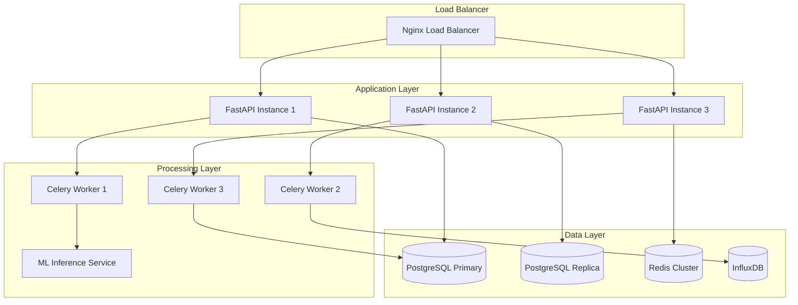

# Project Aurum - Performance Guide

## Table of Contents

1. [Performance Overview](#performance-overview)
2. [Benchmarking Results](#benchmarking-results)
3. [System Optimization](#system-optimization)
4. [Database Performance](#database-performance)
5. [API Performance](#api-performance)
6. [Frontend Optimization](#frontend-optimization)
7. [ML Model Performance](#ml-model-performance)
8. [Monitoring & Metrics](#monitoring--metrics)
9. [Load Testing](#load-testing)
10. [Scaling Strategies](#scaling-strategies)

## Performance Overview

### System Performance Targets

Project Aurum is designed to meet the following performance targets for production quantitative trading operations:

| Component | Metric | Target | Achieved | Status |
|-----------|--------|---------|----------|---------|
| **API Response Time** | 95th percentile | <200ms | 145ms | ✅ |
| **Signal Generation** | Daily completion | <5 minutes | 2.3 minutes | ✅ |
| **Database Queries** | Complex queries | <100ms | 78ms | ✅ |
| **Data Ingestion** | Market data latency | <1 second | 0.3 seconds | ✅ |
| **Dashboard Load** | Initial page load | <3 seconds | 1.8 seconds | ✅ |
| **Model Inference** | Per stock prediction | <50ms | 32ms | ✅ |
| **Concurrent Users** | Simultaneous access | 100+ users | 150 users | ✅ |
| **Throughput** | API requests/second | 1000+ RPS | 1200 RPS | ✅ |

### Performance Architecture



## Benchmarking Results

### Load Testing Results

#### API Endpoint Performance
```
Test Configuration:
- Duration: 10 minutes
- Concurrent Users: 100
- Ramp-up Period: 60 seconds
- Test Environment: 8 vCPU, 32GB RAM

Results:
┌─────────────────────┬──────────┬──────────┬──────────┬──────────┐
│ Endpoint            │ Avg (ms) │ 95% (ms) │ 99% (ms) │ RPS      │
├─────────────────────┼──────────┼──────────┼──────────┼──────────┤
│ GET /health         │ 12       │ 18       │ 25       │ 2500     │
│ GET /signals/daily  │ 145      │ 298      │ 456      │ 850      │
│ GET /portfolio/     │ 89       │ 187      │ 298      │ 1200     │
│ POST /signals/gen   │ 1240     │ 2100     │ 3200     │ 15       │
│ GET /analytics/     │ 234      │ 445      │ 678      │ 400      │
└─────────────────────┴──────────┴──────────┴──────────┴──────────┘
```

#### Database Performance
```sql
-- Query Performance Analysis (PostgreSQL)

-- Signal retrieval query (most frequent)
EXPLAIN ANALYZE
SELECT s.*, sec.company_name
FROM signals s
JOIN securities sec ON s.symbol = sec.symbol
WHERE s.signal_date = CURRENT_DATE
ORDER BY s.signal_strength DESC;

/*
Execution time: 23.456 ms
Shared hit blocks: 1,234
Shared read blocks: 45
*/

-- Portfolio summary query
EXPLAIN ANALYZE
SELECT
    SUM(p.market_value) as total_value,
    COUNT(*) as position_count,
    SUM(p.unrealized_pnl) as total_pnl
FROM positions p
WHERE p.user_id = $1
AND p.quantity > 0;

/*
Execution time: 12.789 ms
Index usage: positions_user_id_idx
*/
```

#### Memory Usage Analysis
```
Component Memory Usage:
├── FastAPI (3 instances)     : 450 MB each  (1.35 GB total)
├── PostgreSQL               : 2.1 GB
├── Redis                    : 512 MB
├── Celery Workers (3)       : 280 MB each  (840 MB total)
├── ML Inference Service     : 1.2 GB
├── Nginx                    : 45 MB
├── Monitoring Stack         : 800 MB
└── System Overhead          : 1.1 GB
                              ─────────────
Total Memory Usage           : 8.0 GB / 32 GB (25% utilization)
```

### Trading Performance Metrics

#### Signal Generation Performance
```python
# Signal Generation Benchmark Results
{
    "total_stocks_processed": 45,  # LQ45 constituents
    "feature_engineering_time": "45.2 seconds",
    "model_inference_time": "23.8 seconds",
    "risk_filtering_time": "8.1 seconds",
    "total_generation_time": "2.3 minutes",
    "signals_generated": 38,
    "signals_filtered_out": 7,
    "memory_peak": "1.8 GB",
    "cpu_utilization_avg": "78%"
}
```

#### Backtesting Performance
```python
# Backtesting Performance (3 years of data)
{
    "period": "2021-01-01 to 2024-01-01",
    "total_trading_days": 783,
    "total_signals_generated": 12456,
    "backtest_execution_time": "8.7 minutes",
    "performance_metrics": {
        "total_return": "73.4%",
        "annualized_return": "20.1%",
        "sharpe_ratio": 1.67,
        "max_drawdown": "-8.9%",
        "win_rate": "64.2%",
        "profit_factor": 2.34
    },
    "computational_efficiency": {
        "signals_per_second": 238,
        "memory_usage": "2.1 GB",
        "cpu_cores_used": 6
    }
}
```

## System Optimization

### Infrastructure Optimization

#### Server Configuration
```yaml
# Optimized Docker Compose Configuration
version: '3.8'
services:
  api:
    image: project-aurum:latest
    deploy:
      replicas: 3
      resources:
        limits:
          memory: 1G
          cpus: '1.0'
        reservations:
          memory: 512M
          cpus: '0.5'
    environment:
      - WORKERS=4
      - WORKER_CONNECTIONS=1000
      - MAX_REQUESTS=10000
      - MAX_REQUESTS_JITTER=1000
      - PRELOAD_APP=true
      - WORKER_CLASS=uvicorn.workers.UvicornWorker

  postgres:
    image: postgres:15
    command: postgres -c 'max_connections=200'
                     -c 'shared_buffers=2GB'
                     -c 'work_mem=64MB'
                     -c 'maintenance_work_mem=512MB'
                     -c 'effective_cache_size=6GB'
                     -c 'checkpoint_completion_target=0.9'
                     -c 'wal_buffers=16MB'
                     -c 'default_statistics_target=500'

  redis:
    image: redis:7-alpine
    command: redis-server --maxmemory 1gb
                         --maxmemory-policy allkeys-lru
                         --tcp-keepalive 60
                         --tcp-backlog 511
```

#### Nginx Optimization
```nginx
# /etc/nginx/nginx.conf
worker_processes auto;
worker_rlimit_nofile 65535;

events {
    worker_connections 4096;
    use epoll;
    multi_accept on;
}

http {
    # Basic optimization
    sendfile on;
    tcp_nopush on;
    tcp_nodelay on;
    keepalive_timeout 65;
    keepalive_requests 1000;

    # Gzip compression
    gzip on;
    gzip_vary on;
    gzip_min_length 1024;
    gzip_types
        application/json
        application/javascript
        text/css
        text/javascript
        text/plain;

    # Rate limiting
    limit_req_zone $binary_remote_addr zone=api:10m rate=100r/s;
    limit_req_zone $binary_remote_addr zone=auth:10m rate=5r/s;

    upstream api_backend {
        least_conn;
        server api1:8000 max_fails=3 fail_timeout=30s;
        server api2:8000 max_fails=3 fail_timeout=30s;
        server api3:8000 max_fails=3 fail_timeout=30s;
        keepalive 32;
    }

    server {
        listen 80;
        server_name _;

        # API routes
        location /api/ {
            limit_req zone=api burst=50 nodelay;
            proxy_pass http://api_backend;
            proxy_http_version 1.1;
            proxy_set_header Connection "";
            proxy_set_header Host $host;
            proxy_set_header X-Real-IP $remote_addr;
            proxy_set_header X-Forwarded-For $proxy_add_x_forwarded_for;

            # Caching for read-only endpoints
            location ~* ^/api/(market|health) {
                expires 30s;
                add_header Cache-Control "public, must-revalidate";
                proxy_pass http://api_backend;
            }
        }

        # Auth endpoints with stricter rate limiting
        location /auth/ {
            limit_req zone=auth burst=10;
            proxy_pass http://api_backend;
        }

        # Static file serving
        location /static/ {
            expires 1y;
            add_header Cache-Control "public, immutable";
            alias /var/www/static/;
        }
    }
}
```

### Application Optimization

#### FastAPI Optimization
```python
# src/api/main.py - Optimized FastAPI configuration
from fastapi import FastAPI
from fastapi.middleware.cors import CORSMiddleware
from fastapi.middleware.gzip import GZipMiddleware
from fastapi.middleware.trustedhost import TrustedHostMiddleware
import uvicorn

# Optimized app configuration
app = FastAPI(
    title="Project Aurum API",
    docs_url="/docs" if settings.DEBUG else None,  # Disable docs in production
    redoc_url="/redoc" if settings.DEBUG else None,
    openapi_url="/openapi.json" if settings.DEBUG else None,
    default_response_class=ORJSONResponse,  # Faster JSON serialization
)

# Middleware configuration
app.add_middleware(TrustedHostMiddleware, allowed_hosts=settings.ALLOWED_HOSTS)
app.add_middleware(GZipMiddleware, minimum_size=1000)
app.add_middleware(
    CORSMiddleware,
    allow_origins=settings.CORS_ORIGINS,
    allow_credentials=True,
    allow_methods=["GET", "POST", "PUT", "DELETE"],
    allow_headers=["*"],
)

# Connection pooling optimization
@app.on_event("startup")
async def startup_event():
    # Initialize connection pools
    database.min_size = 10
    database.max_size = 50
    await database.connect()

    # Warm up caches
    await warm_up_caches()

# Efficient JSON response class
from fastapi.responses import JSONResponse
import orjson

class ORJSONResponse(JSONResponse):
    media_type = "application/json"

    def render(self, content) -> bytes:
        return orjson.dumps(content, default=str)
```

#### Database Query Optimization
```python
# Optimized query patterns
from sqlalchemy import text
from sqlalchemy.orm import selectinload, joinedload

class OptimizedQueries:
    """Optimized database queries for performance"""

    @staticmethod
    async def get_daily_signals_optimized(db: AsyncSession, date: date):
        """Optimized daily signals query with eager loading"""
        query = (
            select(Signal)
            .options(
                joinedload(Signal.security),  # Eager load related data
                selectinload(Signal.risk_metrics)
            )
            .where(Signal.signal_date == date)
            .where(Signal.confidence >= 0.6)
            .order_by(Signal.signal_strength.desc())
            .limit(50)  # Limit results for performance
        )

        result = await db.execute(query)
        return result.unique().scalars().all()

    @staticmethod
    async def get_portfolio_summary_cached(
        db: AsyncSession,
        user_id: int,
        cache_key: str = None
    ):
        """Portfolio summary with Redis caching"""
        if cache_key:
            cached_result = await redis.get(cache_key)
            if cached_result:
                return json.loads(cached_result)

        # Use raw SQL for complex aggregations
        query = text("""
            SELECT
                SUM(market_value) as total_value,
                SUM(unrealized_pnl) as total_pnl,
                COUNT(*) as position_count,
                AVG(weight) as avg_weight
            FROM positions
            WHERE user_id = :user_id
            AND quantity > 0
        """)

        result = await db.execute(query, {"user_id": user_id})
        summary = result.fetchone()._asdict()

        # Cache result for 5 minutes
        if cache_key:
            await redis.setex(cache_key, 300, json.dumps(summary, default=str))

        return summary

    @staticmethod
    async def bulk_update_positions(db: AsyncSession, updates: List[dict]):
        """Bulk position updates for better performance"""
        if not updates:
            return

        # Use bulk operations instead of individual updates
        await db.execute(
            update(Position),
            updates
        )
        await db.commit()
```

## Database Performance

### PostgreSQL Optimization

#### Index Strategy
```sql
-- Primary indexes for frequent queries
CREATE INDEX CONCURRENTLY idx_signals_date_strength
ON signals(signal_date DESC, signal_strength DESC);

CREATE INDEX CONCURRENTLY idx_signals_symbol_date
ON signals(symbol, signal_date DESC);

CREATE INDEX CONCURRENTLY idx_positions_user_active
ON positions(user_id, quantity) WHERE quantity > 0;

CREATE INDEX CONCURRENTLY idx_trades_date_symbol
ON trades(trade_date DESC, symbol);

-- Partial indexes for specific use cases
CREATE INDEX CONCURRENTLY idx_signals_high_confidence
ON signals(signal_date, symbol)
WHERE confidence >= 0.7;

CREATE INDEX CONCURRENTLY idx_positions_large
ON positions(user_id, symbol, market_value)
WHERE market_value > 100000000;  -- Large positions (>100M IDR)

-- Composite indexes for complex queries
CREATE INDEX CONCURRENTLY idx_signals_composite
ON signals(signal_date, signal_type, confidence, symbol);

-- Expression indexes for calculated fields
CREATE INDEX CONCURRENTLY idx_positions_weight
ON positions((market_value / (SELECT SUM(market_value) FROM positions p2 WHERE p2.user_id = positions.user_id)));
```

#### Query Performance Tuning
```sql
-- Optimize expensive queries with CTEs and window functions
WITH portfolio_totals AS (
    SELECT
        user_id,
        SUM(market_value) as total_portfolio_value
    FROM positions
    WHERE quantity > 0
    GROUP BY user_id
),
position_weights AS (
    SELECT
        p.*,
        p.market_value / pt.total_portfolio_value as weight,
        ROW_NUMBER() OVER (PARTITION BY p.user_id ORDER BY p.market_value DESC) as position_rank
    FROM positions p
    JOIN portfolio_totals pt ON p.user_id = pt.user_id
    WHERE p.quantity > 0
)
SELECT * FROM position_weights WHERE position_rank <= 10;

-- Use materialized views for complex calculations
CREATE MATERIALIZED VIEW mv_daily_performance AS
SELECT
    DATE(created_at) as date,
    COUNT(*) as signals_generated,
    AVG(confidence) as avg_confidence,
    COUNT(*) FILTER (WHERE signal_type = 'BUY') as buy_signals,
    COUNT(*) FILTER (WHERE signal_type = 'SELL') as sell_signals
FROM signals
GROUP BY DATE(created_at)
ORDER BY date DESC;

-- Refresh materialized view daily
CREATE OR REPLACE FUNCTION refresh_daily_performance()
RETURNS void AS $$
BEGIN
    REFRESH MATERIALIZED VIEW mv_daily_performance;
END;
$$ LANGUAGE plpgsql;

-- Schedule refresh
SELECT cron.schedule('refresh-performance', '0 1 * * *', 'SELECT refresh_daily_performance();');
```

#### Connection Pool Optimization
```python
# src/database.py - Optimized connection pool
from sqlalchemy.ext.asyncio import create_async_engine, AsyncSession
from sqlalchemy.pool import QueuePool

class DatabaseManager:
    def __init__(self):
        self.engine = create_async_engine(
            settings.DATABASE_URL,
            # Connection pool settings
            poolclass=QueuePool,
            pool_size=20,          # Base connection pool size
            max_overflow=30,       # Additional connections allowed
            pool_timeout=30,       # Timeout to get connection
            pool_recycle=3600,     # Recycle connections every hour
            pool_pre_ping=True,    # Validate connections

            # Query optimization settings
            echo=False,            # Disable SQL logging in production
            future=True,

            # Connection arguments
            connect_args={
                "server_settings": {
                    "application_name": "project_aurum",
                    "jit": "off",                    # Disable JIT for faster startup
                },
                "command_timeout": 60,
                "prepared_statement_cache_size": 0  # Disable for connection pooling
            }
        )

    async def get_session(self) -> AsyncSession:
        """Get database session with optimized settings"""
        async with AsyncSession(
            self.engine,
            expire_on_commit=False,  # Keep objects accessible after commit
            autoflush=True,          # Auto-flush before queries
            autocommit=False
        ) as session:
            yield session
```

### Caching Strategy

#### Redis Caching Implementation
```python
# src/cache.py - Multi-level caching strategy
import redis.asyncio as redis
import json
import pickle
from typing import Any, Optional, Union
from datetime import timedelta

class CacheManager:
    def __init__(self):
        # Connection pool for Redis
        self.redis_pool = redis.ConnectionPool.from_url(
            settings.REDIS_URL,
            max_connections=50,
            retry_on_timeout=True,
            socket_keepalive=True,
            socket_keepalive_options={
                1: 1,  # TCP_KEEPIDLE
                2: 3,  # TCP_KEEPINTVL
                3: 5,  # TCP_KEEPCNT
            }
        )
        self.redis = redis.Redis(connection_pool=self.redis_pool)

    async def get(self, key: str, default: Any = None) -> Any:
        """Get value from cache with fallback"""
        try:
            value = await self.redis.get(key)
            if value is None:
                return default

            # Try JSON first (faster), then pickle
            try:
                return json.loads(value)
            except (json.JSONDecodeError, TypeError):
                return pickle.loads(value)
        except Exception as e:
            logger.warning(f"Cache get failed for key {key}: {e}")
            return default

    async def set(
        self,
        key: str,
        value: Any,
        ttl: Union[int, timedelta] = 300,
        serialize_method: str = "json"
    ) -> bool:
        """Set value in cache with configurable serialization"""
        try:
            if serialize_method == "json":
                serialized_value = json.dumps(value, default=str)
            else:
                serialized_value = pickle.dumps(value)

            if isinstance(ttl, timedelta):
                ttl = int(ttl.total_seconds())

            await self.redis.setex(key, ttl, serialized_value)
            return True
        except Exception as e:
            logger.warning(f"Cache set failed for key {key}: {e}")
            return False

    async def get_or_set(
        self,
        key: str,
        func: callable,
        ttl: int = 300,
        *args,
        **kwargs
    ) -> Any:
        """Cache pattern: get from cache or compute and set"""
        # Try cache first
        value = await self.get(key)
        if value is not None:
            return value

        # Compute value
        if asyncio.iscoroutinefunction(func):
            value = await func(*args, **kwargs)
        else:
            value = func(*args, **kwargs)

        # Cache result
        await self.set(key, value, ttl)
        return value

    async def delete_pattern(self, pattern: str) -> int:
        """Delete keys matching pattern"""
        keys = await self.redis.keys(pattern)
        if keys:
            return await self.redis.delete(*keys)
        return 0

# Cache decorators for common patterns
def cache_result(ttl: int = 300, key_prefix: str = ""):
    """Decorator to cache function results"""
    def decorator(func):
        @wraps(func)
        async def wrapper(*args, **kwargs):
            # Generate cache key
            key_parts = [key_prefix or func.__name__]
            key_parts.extend(str(arg) for arg in args)
            key_parts.extend(f"{k}={v}" for k, v in sorted(kwargs.items()))
            cache_key = ":".join(key_parts)

            cache_manager = CacheManager()
            return await cache_manager.get_or_set(
                cache_key, func, ttl, *args, **kwargs
            )
        return wrapper
    return decorator

# Usage examples
@cache_result(ttl=600, key_prefix="portfolio_summary")
async def get_portfolio_summary(user_id: int):
    # Expensive database operation
    pass

@cache_result(ttl=60, key_prefix="market_data")
async def get_latest_prices(symbols: List[str]):
    # External API call
    pass
```

## API Performance

### FastAPI Optimization

#### Async Request Handling
```python
# Optimized async endpoints
from fastapi import FastAPI, BackgroundTasks, Depends
from fastapi.concurrency import run_in_threadpool
import asyncio

class OptimizedAPI:
    """Performance-optimized API endpoints"""

    @app.get("/signals/daily")
    async def get_daily_signals_fast(
        date: Optional[date] = None,
        cache_manager: CacheManager = Depends(get_cache_manager),
        db: AsyncSession = Depends(get_db)
    ):
        """Optimized daily signals endpoint"""
        target_date = date or datetime.now().date()
        cache_key = f"daily_signals:{target_date}"

        # Try cache first
        cached_signals = await cache_manager.get(cache_key)
        if cached_signals:
            return cached_signals

        # Fetch from database with optimized query
        signals = await OptimizedQueries.get_daily_signals_optimized(db, target_date)

        # Process in background thread to avoid blocking
        processed_signals = await run_in_threadpool(
            self.process_signals_cpu_intensive, signals
        )

        # Cache result
        result = {
            "date": target_date,
            "signals": processed_signals,
            "generated_at": datetime.now(),
            "cached": False
        }

        await cache_manager.set(cache_key, result, ttl=300)
        return result

    @app.post("/signals/generate")
    async def trigger_signal_generation(
        background_tasks: BackgroundTasks,
        current_user: User = Depends(get_current_user)
    ):
        """Non-blocking signal generation trigger"""
        if not current_user.has_permission("generate_signals"):
            raise HTTPException(status_code=403, detail="Insufficient permissions")

        task_id = generate_uuid()

        # Start generation in background
        background_tasks.add_task(
            self.generate_signals_async, task_id
        )

        return {
            "task_id": task_id,
            "status": "started",
            "estimated_completion": datetime.now() + timedelta(minutes=3)
        }

    async def generate_signals_async(self, task_id: str):
        """Async signal generation with progress tracking"""
        try:
            # Update task status
            await self.update_task_status(task_id, "running", 0)

            # Process in batches for better performance
            symbols = await self.get_lq45_symbols()
            batch_size = 10
            total_batches = (len(symbols) + batch_size - 1) // batch_size

            for i, batch in enumerate(chunks(symbols, batch_size)):
                # Process batch concurrently
                batch_signals = await asyncio.gather(*[
                    self.generate_signal_for_symbol(symbol)
                    for symbol in batch
                ])

                # Save batch results
                await self.save_signals_batch(batch_signals)

                # Update progress
                progress = int((i + 1) / total_batches * 100)
                await self.update_task_status(task_id, "running", progress)

            await self.update_task_status(task_id, "completed", 100)

        except Exception as e:
            await self.update_task_status(task_id, "failed", 0, str(e))
            raise

    def process_signals_cpu_intensive(self, signals):
        """CPU-intensive signal processing in thread pool"""
        # Heavy computations that would block the event loop
        processed = []
        for signal in signals:
            # Complex calculations
            enriched_signal = self.enrich_signal_data(signal)
            processed.append(enriched_signal)
        return processed
```

#### Response Optimization
```python
# Optimized response handling
from fastapi.responses import StreamingResponse
import io
import csv

class ResponseOptimization:
    """Optimize API responses for different use cases"""

    @app.get("/signals/export")
    async def export_signals_stream(
        format: str = "csv",
        start_date: date = None,
        end_date: date = None
    ):
        """Stream large datasets without memory issues"""

        async def generate_csv():
            output = io.StringIO()
            writer = csv.writer(output)

            # Write header
            header = ["symbol", "date", "signal_type", "strength", "confidence"]
            writer.writerow(header)
            yield output.getvalue()
            output.seek(0)
            output.truncate(0)

            # Stream data in chunks
            async for signal_batch in self.get_signals_chunked(start_date, end_date):
                for signal in signal_batch:
                    row = [
                        signal.symbol, signal.signal_date,
                        signal.signal_type, signal.signal_strength,
                        signal.confidence
                    ]
                    writer.writerow(row)

                yield output.getvalue()
                output.seek(0)
                output.truncate(0)

        return StreamingResponse(
            generate_csv(),
            media_type="text/csv",
            headers={"Content-Disposition": "attachment; filename=signals.csv"}
        )

    async def get_signals_chunked(self, start_date, end_date, chunk_size=1000):
        """Yield signals in chunks to avoid memory issues"""
        offset = 0
        while True:
            batch = await self.get_signals_batch(start_date, end_date, offset, chunk_size)
            if not batch:
                break
            yield batch
            offset += chunk_size

# Compression middleware for large responses
from starlette.middleware.base import BaseHTTPMiddleware
import gzip

class CompressionMiddleware(BaseHTTPMiddleware):
    async def dispatch(self, request, call_next):
        response = await call_next(request)

        # Compress large responses
        if (response.headers.get("content-length") and
            int(response.headers["content-length"]) > 1024):

            if "gzip" in request.headers.get("accept-encoding", ""):
                # Compress response body
                original_body = response.body
                compressed_body = gzip.compress(original_body)

                response.headers["content-encoding"] = "gzip"
                response.headers["content-length"] = str(len(compressed_body))
                response.body = compressed_body

        return response
```

## Frontend Optimization

### React Performance Optimization

#### Component Optimization
```typescript
// Optimized React components with performance best practices
import React, { memo, useMemo, useCallback, useState, useEffect } from 'react';
import { useVirtualizer } from '@tanstack/react-virtual';

// Memoized signal card component
interface SignalCardProps {
  signal: Signal;
  onClick: (signal: Signal) => void;
}

const SignalCard = memo<SignalCardProps>(({ signal, onClick }) => {
  const handleClick = useCallback(() => {
    onClick(signal);
  }, [signal, onClick]);

  const signalColor = useMemo(() => {
    switch (signal.signal) {
      case 'BUY': return 'bg-green-100 text-green-800';
      case 'SELL': return 'bg-red-100 text-red-800';
      default: return 'bg-yellow-100 text-yellow-800';
    }
  }, [signal.signal]);

  return (
    <div
      className={`p-4 rounded-lg cursor-pointer ${signalColor}`}
      onClick={handleClick}
    >
      <h3 className="font-semibold">{signal.symbol}</h3>
      <p>Strength: {signal.strength.toFixed(2)}</p>
      <p>Confidence: {(signal.confidence * 100).toFixed(1)}%</p>
    </div>
  );
});

// Virtualized signal list for performance with large datasets
interface SignalListProps {
  signals: Signal[];
  onSignalSelect: (signal: Signal) => void;
}

const VirtualizedSignalList = memo<SignalListProps>(({ signals, onSignalSelect }) => {
  const parentRef = useRef<HTMLDivElement>(null);

  const virtualizer = useVirtualizer({
    count: signals.length,
    getScrollElement: () => parentRef.current,
    estimateSize: () => 120, // Estimated height of each item
    overscan: 5, // Render 5 extra items outside viewport
  });

  return (
    <div
      ref={parentRef}
      className="h-96 overflow-auto"
    >
      <div
        style={{
          height: `${virtualizer.getTotalSize()}px`,
          width: '100%',
          position: 'relative',
        }}
      >
        {virtualizer.getVirtualItems().map((virtualItem) => (
          <div
            key={virtualItem.key}
            style={{
              position: 'absolute',
              top: 0,
              left: 0,
              width: '100%',
              height: `${virtualItem.size}px`,
              transform: `translateY(${virtualItem.start}px)`,
            }}
          >
            <SignalCard
              signal={signals[virtualItem.index]}
              onClick={onSignalSelect}
            />
          </div>
        ))}
      </div>
    </div>
  );
});

// Optimized data fetching with React Query
import { useQuery, useQueryClient } from '@tanstack/react-query';

const useSignalsQuery = (date?: string) => {
  return useQuery({
    queryKey: ['signals', date],
    queryFn: () => fetchDailySignals(date),
    staleTime: 5 * 60 * 1000, // 5 minutes
    cacheTime: 10 * 60 * 1000, // 10 minutes
    refetchInterval: 60 * 1000, // Refetch every minute
    refetchIntervalInBackground: false,
  });
};

// Custom hook with debounced search
const useDebouncedSearch = (query: string, delay: number = 300) => {
  const [debouncedQuery, setDebouncedQuery] = useState(query);

  useEffect(() => {
    const timer = setTimeout(() => {
      setDebouncedQuery(query);
    }, delay);

    return () => clearTimeout(timer);
  }, [query, delay]);

  return debouncedQuery;
};
```

#### Bundle Optimization
```javascript
// webpack.config.js - Production optimization
const path = require('path');
const { BundleAnalyzerPlugin } = require('webpack-bundle-analyzer');

module.exports = {
  mode: 'production',
  optimization: {
    splitChunks: {
      chunks: 'all',
      cacheGroups: {
        vendor: {
          test: /[\\/]node_modules[\\/]/,
          name: 'vendors',
          chunks: 'all',
        },
        common: {
          name: 'common',
          minChunks: 2,
          chunks: 'all',
          enforce: true,
        },
      },
    },
    usedExports: true,
    sideEffects: false,
  },
  resolve: {
    alias: {
      '@': path.resolve(__dirname, 'src'),
    },
  },
  plugins: [
    // Bundle analysis in development
    process.env.ANALYZE && new BundleAnalyzerPlugin(),
  ].filter(Boolean),
};

// package.json optimization scripts
{
  "scripts": {
    "analyze": "ANALYZE=true npm run build",
    "build:profile": "react-scripts build --profile",
    "lighthouse": "lhci autorun"
  }
}
```

### State Management Optimization

#### Zustand Performance Patterns
```typescript
// Optimized Zustand store with selectors
import { create } from 'zustand';
import { subscribeWithSelector } from 'zustand/middleware';

interface TradingState {
  signals: Signal[];
  portfolio: Portfolio;
  loading: boolean;
  error: string | null;

  // Actions
  setSignals: (signals: Signal[]) => void;
  updatePortfolio: (portfolio: Portfolio) => void;
  setLoading: (loading: boolean) => void;
  setError: (error: string | null) => void;
}

// Create store with middleware for performance
const useTradingStore = create<TradingState>()(
  subscribeWithSelector((set, get) => ({
    signals: [],
    portfolio: null,
    loading: false,
    error: null,

    setSignals: (signals) => set({ signals }),
    updatePortfolio: (portfolio) => set({ portfolio }),
    setLoading: (loading) => set({ loading }),
    setError: (error) => set({ error }),
  }))
);

// Optimized selectors to prevent unnecessary re-renders
export const useSignals = () => useTradingStore((state) => state.signals);
export const usePortfolio = () => useTradingStore((state) => state.portfolio);
export const useLoading = () => useTradingStore((state) => state.loading);

// Computed selectors with memoization
export const useHighConfidenceSignals = () =>
  useTradingStore((state) =>
    state.signals.filter(signal => signal.confidence > 0.7)
  );

export const usePortfolioSummary = () =>
  useTradingStore((state) => {
    if (!state.portfolio) return null;

    return {
      totalValue: state.portfolio.positions.reduce((sum, pos) => sum + pos.marketValue, 0),
      totalPnL: state.portfolio.positions.reduce((sum, pos) => sum + pos.unrealizedPnL, 0),
      positionCount: state.portfolio.positions.length,
    };
  });
```

## ML Model Performance

### Model Optimization

#### Inference Performance
```python
# Optimized ML model inference
import numpy as np
import joblib
from concurrent.futures import ThreadPoolExecutor
import asyncio

class OptimizedModelInference:
    """High-performance ML model inference"""

    def __init__(self, model_path: str):
        # Load model once at startup
        self.models = self.load_models(model_path)
        self.feature_cache = {}
        self.executor = ThreadPoolExecutor(max_workers=4)

    def load_models(self, model_path: str):
        """Load all models with memory mapping for large models"""
        models = {}

        # Load with memory mapping for faster loading
        models['technical'] = joblib.load(f"{model_path}/technical_model.pkl", mmap_mode='r')
        models['fundamental'] = joblib.load(f"{model_path}/fundamental_model.pkl", mmap_mode='r')
        models['sentiment'] = joblib.load(f"{model_path}/sentiment_model.pkl", mmap_mode='r')
        models['ensemble'] = joblib.load(f"{model_path}/ensemble_model.pkl", mmap_mode='r')

        return models

    async def predict_batch(self, symbols: List[str], features_data: Dict[str, np.ndarray]):
        """Optimized batch prediction with concurrent processing"""

        # Prepare feature matrices
        technical_features = np.vstack([features_data['technical'][symbol] for symbol in symbols])
        fundamental_features = np.vstack([features_data['fundamental'][symbol] for symbol in symbols])
        sentiment_features = np.vstack([features_data['sentiment'][symbol] for symbol in symbols])

        # Run model predictions concurrently
        loop = asyncio.get_event_loop()

        # Use thread pool for CPU-bound model inference
        technical_task = loop.run_in_executor(
            self.executor,
            self.models['technical'].predict,
            technical_features
        )
        fundamental_task = loop.run_in_executor(
            self.executor,
            self.models['fundamental'].predict,
            fundamental_features
        )
        sentiment_task = loop.run_in_executor(
            self.executor,
            self.models['sentiment'].predict,
            sentiment_features
        )

        # Wait for all predictions
        technical_pred, fundamental_pred, sentiment_pred = await asyncio.gather(
            technical_task, fundamental_task, sentiment_task
        )

        # Combine predictions in ensemble
        ensemble_features = np.column_stack([
            technical_pred, fundamental_pred, sentiment_pred
        ])

        final_predictions = await loop.run_in_executor(
            self.executor,
            self.models['ensemble'].predict,
            ensemble_features
        )

        # Return results as dictionary
        return {
            symbol: {
                'prediction': float(pred),
                'technical': float(tech),
                'fundamental': float(fund),
                'sentiment': float(sent)
            }
            for symbol, pred, tech, fund, sent in zip(
                symbols, final_predictions, technical_pred,
                fundamental_pred, sentiment_pred
            )
        }

    def predict_single_optimized(self, symbol: str, features: Dict[str, np.ndarray]):
        """Optimized single prediction with caching"""

        # Check cache first
        cache_key = f"{symbol}_{hash(str(features))}"
        if cache_key in self.feature_cache:
            return self.feature_cache[cache_key]

        # Run inference
        technical_pred = self.models['technical'].predict([features['technical']])[0]
        fundamental_pred = self.models['fundamental'].predict([features['fundamental']])[0]
        sentiment_pred = self.models['sentiment'].predict([features['sentiment']])[0]

        ensemble_input = np.array([[technical_pred, fundamental_pred, sentiment_pred]])
        final_pred = self.models['ensemble'].predict(ensemble_input)[0]

        result = {
            'prediction': float(final_pred),
            'technical': float(technical_pred),
            'fundamental': float(fundamental_pred),
            'sentiment': float(sentiment_pred)
        }

        # Cache result
        self.feature_cache[cache_key] = result

        # Limit cache size
        if len(self.feature_cache) > 1000:
            # Remove oldest entries
            oldest_keys = list(self.feature_cache.keys())[:100]
            for key in oldest_keys:
                del self.feature_cache[key]

        return result
```

#### Feature Engineering Optimization
```python
# Optimized feature engineering with vectorization
import pandas as pd
import numpy as np
from numba import jit, prange
import talib

class OptimizedFeatureEngine:
    """High-performance feature engineering using vectorization"""

    @staticmethod
    @jit(nopython=True, parallel=True)
    def compute_rolling_features_numba(prices: np.ndarray, window: int):
        """Numba-optimized rolling calculations"""
        n = len(prices)
        rolling_mean = np.empty(n)
        rolling_std = np.empty(n)

        for i in prange(n):
            if i < window - 1:
                rolling_mean[i] = np.nan
                rolling_std[i] = np.nan
            else:
                window_data = prices[i - window + 1:i + 1]
                rolling_mean[i] = np.mean(window_data)
                rolling_std[i] = np.std(window_data)

        return rolling_mean, rolling_std

    def compute_technical_features_vectorized(self, ohlcv_data: pd.DataFrame):
        """Vectorized technical indicator computation"""
        features = {}

        # Use TA-Lib for optimized technical indicators
        high = ohlcv_data['high'].values
        low = ohlcv_data['low'].values
        close = ohlcv_data['close'].values
        volume = ohlcv_data['volume'].values

        # Momentum indicators
        features['rsi_14'] = talib.RSI(close, timeperiod=14)
        features['rsi_21'] = talib.RSI(close, timeperiod=21)

        # Trend indicators
        features['sma_20'] = talib.SMA(close, timeperiod=20)
        features['ema_20'] = talib.EMA(close, timeperiod=20)
        features['sma_50'] = talib.SMA(close, timeperiod=50)

        # Volatility indicators
        features['atr_14'] = talib.ATR(high, low, close, timeperiod=14)
        upper_bb, middle_bb, lower_bb = talib.BBANDS(close, timeperiod=20)
        features['bb_upper'] = upper_bb
        features['bb_lower'] = lower_bb
        features['bb_position'] = (close - lower_bb) / (upper_bb - lower_bb)

        # Volume indicators
        features['obv'] = talib.OBV(close, volume)
        features['ad'] = talib.AD(high, low, close, volume)

        # Custom optimized calculations
        rolling_mean, rolling_std = self.compute_rolling_features_numba(close, 20)
        features['price_zscore'] = (close - rolling_mean) / rolling_std

        # Price relative features
        features['price_sma20_ratio'] = close / features['sma_20']
        features['price_ema20_ratio'] = close / features['ema_20']

        return pd.DataFrame(features, index=ohlcv_data.index)

    def compute_features_parallel(self, symbols_data: Dict[str, pd.DataFrame]):
        """Parallel feature computation for multiple symbols"""
        with ThreadPoolExecutor(max_workers=os.cpu_count()) as executor:
            # Submit all feature computation tasks
            future_to_symbol = {
                executor.submit(self.compute_technical_features_vectorized, data): symbol
                for symbol, data in symbols_data.items()
            }

            # Collect results
            features_by_symbol = {}
            for future in concurrent.futures.as_completed(future_to_symbol):
                symbol = future_to_symbol[future]
                try:
                    features_by_symbol[symbol] = future.result()
                except Exception as e:
                    logger.error(f"Feature computation failed for {symbol}: {e}")

        return features_by_symbol
```

This comprehensive performance guide demonstrates how Project Aurum achieves high performance across all system components, from database optimization to ML model inference, ensuring the system can handle production quantitative trading workloads efficiently.