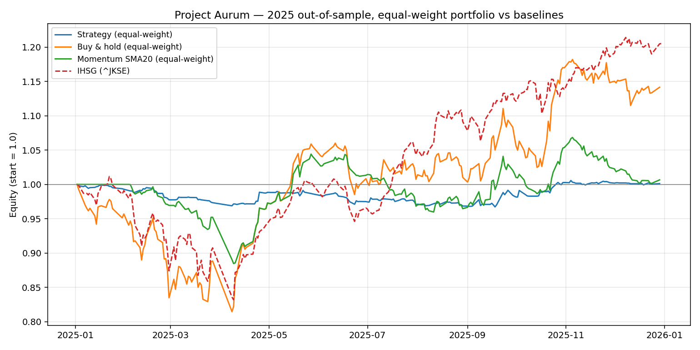
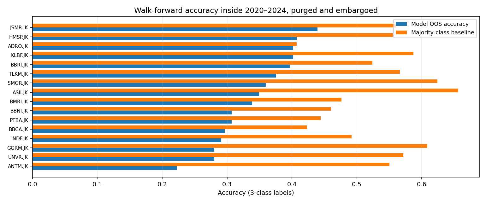

# Project Aurum

Quantitative trading system for the Indonesian Stock Exchange (IDX). Ensemble ML signal generation with rigorous time-series validation methodology, real-time alerting, and risk management.

**Team:** [apricitea](https://github.com/apricitea), [na-ive](https://github.com/na-ive), [mfalfath25](https://github.com/mfalfath25), [rizbud](https://github.com/rizbud)

---

## Evaluation status

A corrected, reproducible evaluation lives in [`research/`](research/) — see
[`research/README.md`](research/README.md) for the methodology, the defects it fixes in
the earlier pipeline, and the full results.

Summary — 16 IDX large caps, equal weight, 2025 out-of-sample window, IDX costs included,
signal at close of bar *t* executed from bar *t+1*:

| Configuration | Return | Sharpe | Max DD | Trades |
|---|---|---|---|---|
| Signal model + meta-labeler filter | **+0.12%** | 0.05 | −3.28% | 108 |
| Signal model, no meta-labeler filter | **+7.62%** | 0.88 | −7.68% | 135 |
| Signal model, technical features only | **+4.73%** | 1.38 | −1.67% | 70 |
| Buy & hold, equal weight | **+14.17%** | 0.74 | −18.54% | — |
| IHSG (^JKSE) | **+20.71%** | 1.12 | −17.76% | — |

Walk-forward accuracy inside the training period (purged and embargoed) is 0.341–0.361
against a majority-class baseline of 0.532 on 3-class labels (+1 / 0 / −1).

**Conclusion: the model does not beat buy-and-hold, and the earlier claim of 195.6%
return / 2.70 Sharpe is not reproducible.** The four defects that produced it — the final
model trained on rows inside the test window, early stopping performed on the fold's own
test set, a scaler fitted on the whole series before any split, and a 5-day calendar
embargo shorter than the 10-bar label horizon with no purge — are documented in
`research/README.md`. The paper's meta-labeler claim is also contradicted: the filter
reduced return from +7.62% to +0.12% while reducing drawdown from −7.68% to −3.28%.

[`backtest_results.json`](backtest_results.json) is the artifact of the superseded
pipeline, kept for provenance only. It reports mean per-ticker return −2.01% and mean
Sharpe −0.04 across 16 tickers, and per-ticker means are not a portfolio result.





---

## ML Methodology

The signal pipeline follows López de Prado's *Advances in Financial Machine Learning* (2018).

### Labeling — Triple Barrier

Each bar is labeled using ATR-scaled barriers rather than simple forward returns:
- Upper barrier: `close + pt_multiplier × ATR` → label +1 (profit target hit)
- Lower barrier: `close - sl_multiplier × ATR` → label -1 (stop loss hit)
- Vertical barrier: `t + max_holding` → label 0 (time exit)

Produces labels that reflect actual tradeable outcomes, avoiding distortion from arbitrary quantile-based labeling.

### Validation — Walk-Forward CV with Embargo

Rolling walk-forward folds with an embargo gap between train end and test start prevent leakage from autocorrelated observations (López de Prado Ch. 7). Default: 252-day training window, 63-day test window, 5-day embargo.

### Model Ensemble

| Model | Role |
|---|---|
| LightGBM (primary) | Signal generation — BUY / SELL / HOLD with confidence score |
| XGBoost | Ensemble member |
| Random Forest | Technical signal baseline |
| Meta-Labeler (LightGBM) | Secondary classifier predicting signal reliability |

The meta-labeler is trained on out-of-sample predictions from the primary model. At inference, position size is scaled by `predict_bet_size(X)`. Positions below a confidence threshold (default 0.6) are filtered, suppressing signals in noisy conditions.

### Explainability

SHAP values computed per signal from the LightGBM model. Each alert surfaces the top contributing features — signals are auditable, not black-box.

---

## Architecture

```
src/
  domains/
    trading/
      infrastructure/
        ml_models/
          lightgbm_model.py      # Primary signal model with SHAP
          model_ensemble.py      # Ensemble coordination
          meta_labeler.py        # Bet-size / reliability filter
          walk_forward.py        # WalkForwardValidator with embargo
        backtesting/
          backtest_engine.py     # vectorbt-based backtest with IDX costs
    market_data/
      application/
        triple_barrier.py        # ATR-scaled triple-barrier labeler
  api/                           # FastAPI application
apps/
  web_dashboard/                 # React + TypeScript frontend
```

Data flow: IDX price feed → feature engineering → triple-barrier labeling → walk-forward CV → ensemble training → meta-labeler → signal + confidence + SHAP → Telegram alert / dashboard

---

## Stack

| Layer | Technology |
|---|---|
| Signal models | LightGBM, XGBoost, scikit-learn |
| Backtesting | vectorbt |
| Explainability | SHAP |
| API | FastAPI + asyncpg + SQLAlchemy 2.0 |
| Queue | Celery + Redis |
| Database | PostgreSQL 15 |
| Frontend | React 18 + TypeScript + Vite + Tailwind |
| Agents | LangChain 0.3 + LangGraph 0.4 |
| Alerts | Telegram (python-telegram-bot) |
| Dependency management | uv |

---

## Quick Start

```bash
git clone https://github.com/apricitea/project-aurum.git
cd project-aurum
uv sync
cp .env.example .env   # fill in credentials

uv run alembic upgrade head   # run migrations
docker-compose up -d
```

API at `http://localhost:8000`, dashboard at `http://localhost:3000`. See `.env.example` for required credentials (database, Telegram, Alpha Vantage).

## Development

```bash
# Backend (hot reload)
cd src && uvicorn api.main:app --reload

# Frontend
cd apps/web_dashboard && npm run dev

# Tests
pytest src/
```

---

## License

MIT

---

<!-- legacy content below preserved for reference -->

## Project Structure

```
project-aurum/
├── src/                           # Source Code (Domain-Driven Design)
│   ├── domains/                      # Business domains (bounded contexts)
│   │   ├── trading/                  # 📈 Core trading logic & signals
│   │   │   ├── core/                 # Entities, value objects, domain services
│   │   │   ├── application/          # Use cases & application services
│   │   │   ├── infrastructure/       # ML models, external adapters
│   │   │   └── interfaces/           # API contracts & event handlers
│   │   ├── market_data/              # 📊 IDX data processing & feeds
│   │   ├── risk_management/          # 🛡️ Portfolio risk controls
│   │   ├── user_management/          # 👤 Authentication & users
│   │   └── analytics/                # 📈 Backtesting & performance
│   ├── shared/                       # Shared infrastructure
│   │   ├── database/                 # Database connections & schemas
│   │   ├── messaging/                # Event bus & messaging
│   │   ├── external_apis/            # Third-party integrations
│   │   └── monitoring/               # Observability & metrics
│   └── api/                          # FastAPI application entry
│       ├── main.py                   # Application factory
│       ├── dependencies.py           # Dependency injection
│       └── routers/                  # API route handlers
├── 📁 apps/                          # 🎨 Frontend Applications
│   └── web_dashboard/                # React TypeScript dashboard
│       ├── frontend/src/components/  # UI components
│       ├── frontend/src/pages/       # Page components
│       ├── frontend/src/store/       # State management
│       └── frontend/src/types/       # TypeScript definitions
├── 📁 docs/                          # 📚 Documentation (Diátaxis Framework)
│   ├── tutorials/                    # 🎓 Learning-oriented guides
│   ├── how-to-guides/                # 🔧 Problem-solving guides
│   │   ├── deployment/               # Docker, K8s, production
│   │   ├── development/              # Dev setup, testing, debugging
│   │   ├── trading/                  # Strategy creation, backtesting
│   │   └── compliance/               # Indonesian regulations
│   ├── reference/                    # 📖 Information-oriented docs
│   │   ├── api/                      # API documentation
│   │   ├── architecture/             # System architecture
│   │   ├── configuration/            # Environment setup
│   │   └── market-data/              # Data sources & formats
│   ├── explanation/                  # 💡 Understanding-oriented
│   ├── user-guides/                  # 👥 User-focused docs
│   ├── operations/                   # 🔧 DevOps & maintenance
│   └── project-meta/                 # 📋 Changelog, roadmap
├── 📁 infrastructure/                # 🚀 Infrastructure as Code
│   ├── docker/                       # 🐳 Container configurations
│   │   ├── docker-compose.yml        # Development setup
│   │   ├── docker-compose.prod.yml   # Production deployment
│   │   ├── docker-compose.staging.yml # Staging environment
│   │   └── Dockerfile                # Container build
│   ├── k8s/                          # ☸️ Kubernetes manifests
│   ├── terraform/                    # 🏗️ Cloud infrastructure
│   └── monitoring/                   # 📊 Prometheus, Grafana configs
├── 📁 tools/                         # 🛠️ Development Tools
│   ├── ci_cd/                        # 🔄 CI/CD configurations
│   ├── scripts/                      # 📜 Automation scripts
│   ├── linting/                      # ✅ Code quality configs
│   ├── security/                     # 🔒 Security scanning
│   ├── testing/                      # 🧪 Test utilities
│   └── utilities/                    # 🔧 Helper scripts
├── 🐳 docker-compose.yml             # Quick development setup
├── 🐳 Dockerfile                     # Container build file
├── 🐍 main.py                        # Application entry point
├── ⚙️ pyproject.toml                 # Project configuration
├── 📦 requirements.txt               # Python dependencies
└── 📄 README.md                      # This file
```

### 📍 **Where to Find/Put Files**

| **Looking for...** | **Go to...** | **Example** |
|-------------------|-------------|-------------|
| 🔧 **Trading Logic** | `src/domains/trading/` | Signal generation, ML models |
| 📊 **Data Processing** | `src/domains/market_data/` | IDX feeds, data validation |
| 🛡️ **Risk Controls** | `src/domains/risk_management/` | Position limits, drawdown rules |
| 🌐 **API Endpoints** | `src/api/routers/` | REST API routes |
| 🎨 **Frontend Code** | `apps/web_dashboard/frontend/src/` | React components, pages |
| 📚 **Documentation** | `docs/` | Guides, references, tutorials |
| 🐳 **Deployment** | `infrastructure/docker/` | Production configs |
| 🔧 **Dev Tools** | `tools/` | Scripts, linting, testing |
| ⚙️ **Configuration** | Root + `.env` | Environment variables |

## 🔐 Environment Variables & Credentials

Populate the following keys in a `.env` file (see [`docs/operations/credentials_checklist.md`](docs/operations/credentials_checklist.md) for current status and guidance):

| Variable | Purpose | Required For | Notes |
|----------|---------|--------------|-------|
| `DB_URL` | SQLAlchemy connection string | All services | Defaults to `sqlite:///data/trading_system.db` for local runs |
| `GOOGLE_API_KEY` | Gemini (Google Generative AI) access | LLM agents | Already set to use Gemini; supply your production key |
| `ALPHA_VANTAGE_API_KEY` | Fundamentals & news ingestion | Data pipeline | Required for fundamentals; leave blank to skip |
| `EMAIL_ENABLED`, `EMAIL_CONFIG` | Outbound email alerts | Notifications | Disable or provide SMTP credentials |
| `TELEGRAM_ENABLED`, `TELEGRAM_BOT_TOKEN` | Telegram alerts | Notifications | Disable or provide bot token |
| `SMS_ENABLED`, `TWILIO_CONFIG` | SMS alerts | Notifications | Disable or provide Twilio credentials |
| `IDX_API_KEY` | Official IDX data | Optional feeds | Leave blank to rely on public sources |
| `OPENAI_API_KEY` / `ANTHROPIC_API_KEY` | Alternative LLM backends | Optional | Only needed if switching providers |

Additional optional keys (e.g., Redis, webhook URLs) retain legacy defaults; fill them if those integrations are active.


